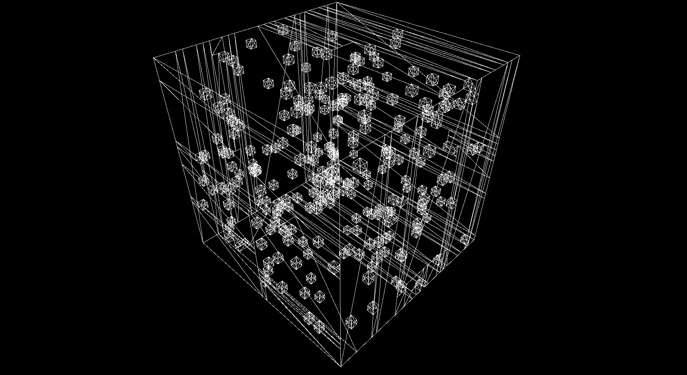

# Voxel Visualization in Rust (vvrs)

A grid-based simulator.

## Features

- [x] **Efficient terrain rasterization** - binary greedy meshing [1], combined
  with other methods [2], is being
  used so frame-by-frame rebuilding of mesh data won't significantly slow
  simulation speed.
- [ ] **Terrain occlusion** - removal of non-visible chunks will chunk the draw
  call significantly, squeezing more performance for the simulation.
- [ ] **Simulation constrainsts** - a general framework defining rules similar
  in nature to cellular automata is being developed, but is also still very rough.

## Acknowledgements
[1] [Meshing in a Minecraft Game](https://0fps.net/2012/06/30/meshing-in-a-minecraft-game/) 0 FPS - Mostly geometry
[2] [High Performance Voxel Engine: Vertex Pooling](https://nickmcd.me/2021/04/04/high-performance-voxel-engine/) Nick's Blog